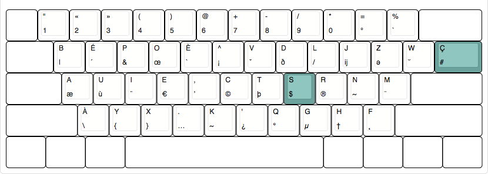

# Ær

Ær est une disposition BÉPO pour développeurs adapté aux claviers ANSI 60% et Tenkeyless.

Les claviers américains (ANSI) disposent d'une touche de moins que les claviers Européens (ISO). Cela pose un problème avec la disposition BÉPO ou la touche manquante est la touche permettant d'écrire les symboles `$`et `#`.

Cette disposition rend de nouveau accessible ces symboles via la couche `AltGR` respectivement sur les touches `S` et `Ç`.

*Note: Cela implique le remplacements des symboles `ß` et `¸` assez inutiles pour la plupart des développeurs*.



Pour installer la disposition sur OSX :

```
cp simple/osx/aer.keylayout /Library/Keyboard\ Layouts/
```