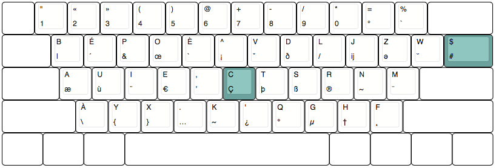

# Ær

Ær est une disposition BÉPO pour développeurs adapté aux claviers ANSI 60% et Tenkeyless.

Les claviers américains (ANSI) disposent d'une touche de moins que les claviers Européens (ISO). Cela pose un problème avec la disposition BÉPO ou la touche manquante est la touche permettant d'écrire les symboles `$`et `#`.

## V1

Cette disposition rend de nouveau accessible ces symboles en déplacant la touche manquante à la place de la touche `Ç`, et déplace le `ç` en `AltGR` + `c` et le `Ç` en `AltGR` + `C`.

*Note: Cela implique la disparition du symbole `¸` inutile pour la plupart des développeurs*.



Pour installer la disposition sur OSX :

```
cp v1/osx/aer.keylayout /Library/Keyboard\ Layouts/
```
## V2


Pour installer la disposition sur OSX :

```
cp v2/osx/aer-v2.keylayout /Library/Keyboard\ Layouts/
```

## 
